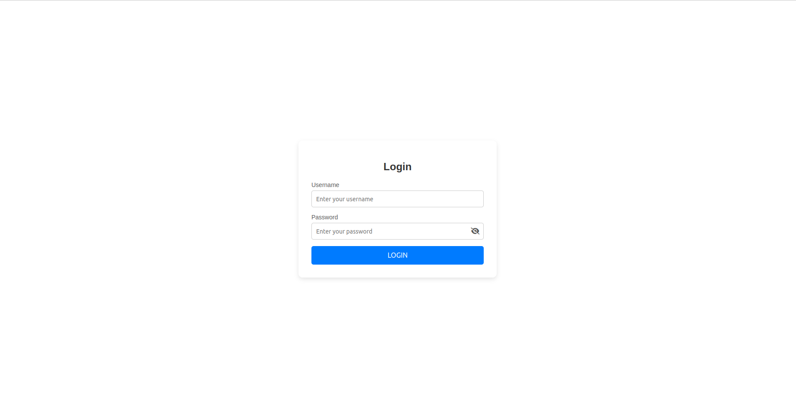
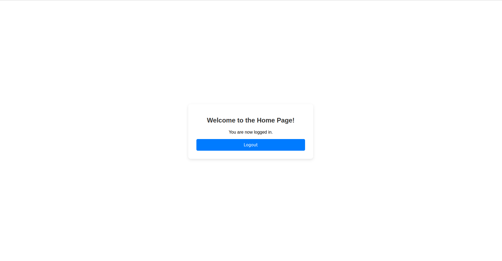

# Attendance System

A simple attendance system with a Spring Boot backend and an HTML/JavaScript frontend.

## Features

- **Login Page:** Users can log in with a username and password.
- **Home Page:** Displays a welcome message and a logout button.
- **Authentication:** Uses JWT for secure login.

## Setup

### Backend

1. Navigate to the server folder:
   ```bash
   cd attendance-system/server
   ```
2. Build and run the Spring Boot app:
   ```bash
   mvn clean install
   mvn spring-boot:run
   ```

### Frontend

1. Open the client folder:
   ```bash
   cd attendance-system/client
   ```
2. Open `login.html` in your browser.

## Login Credentials

- **Username:** `admin`
- **Password:** `password`

## Project Structure
```
attendance-system/
    ├── server/          # Spring Boot backend
    ├── client/          # Frontend (HTML, CSS, JS)
    └── docs/            # Screenshots
```

## Screenshots

- **Login Page:** 
- **Home Page:** 

